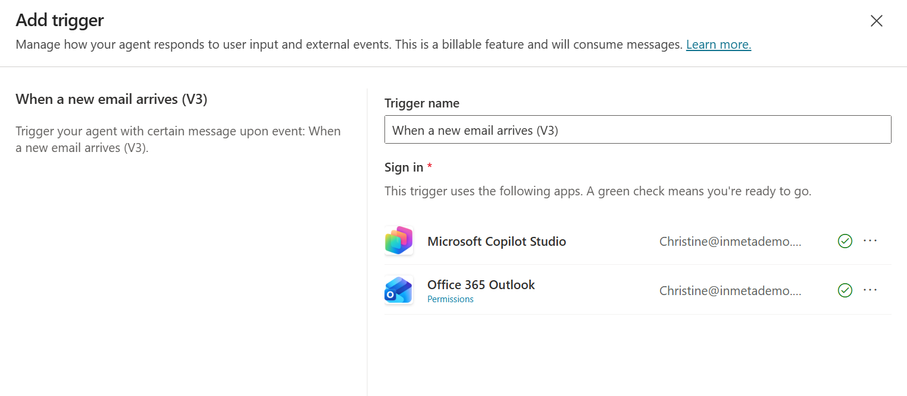
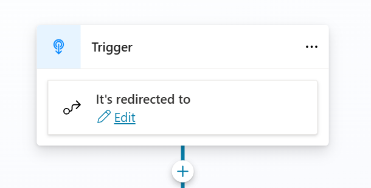

# LAB 6 — Extract action items from email

*Add an Outlook trigger that ingests emails (e.g., policy updates, benefits announcements, mandatory training information) and routes the body to your HR agent for action‑item extraction.*

## Why This Matters

Inbound automation converts passive content into actionable data with zero copy‑paste.

## 🌐 Introduction

Configure `When a new email arrives (V3)` to watch for a specific subject and pass the content to the agent with additional instructions. This sets the stage for unattended ingestion.

## 🎓 Core Concepts Overview

|Concept|Why it matters|
|--|--|
|Event‑driven triggers|Bring fresh data to the agent without manual steps.|
|Connector health|Green status avoids silent failures.|
|Targeted subject filters|Prevents noisy or irrelevant processing.|
|Trigger‑specific instructions|Tailor the agent’s behavior for this pathway.|

## 📄 Documentation and Additional Training Links

- [Event triggers overview](https://learn.microsoft.com/en-us/microsoft-copilot-studio/authoring-triggers-about)
- [Office 365 Outlook connector](https://learn.microsoft.com/en-us/connectors/office365/)
- [Email triggers in Power Automate - When a new email arrives (V3)](https://learn.microsoft.com/en-us/power-automate/email-triggers)

## ✅ Prerequisites

- Working agent from [Lab 1](../lab-01/README.md) and [Lab 2](../lab-02/README.md).
- Office 365 Outlook connector available and authenticated.
- Permission to add Triggers in the agent.

## 🎯 Summary of Targets

- Create a trigger named HR Newsletter with a subject filter.
- Provide concise additional instructions so the agent extracts the employee action items from the email Body (and captures deadlines if present).
- Validate end‑to‑end with a sample email.

***

## 🛠️ Instructions

1. On the agent **Overview** page, navigate to **Triggers** and select **Add trigger**.
2. Select **When a new email arrives (V3)** and **Next**.
3. Rename the trigger to `HR Newsletter Intake`.
4. Confirm that **Microsoft Copilot Studio** and **Office 365 Outlook** connectors show green status.

5. Select **Next**.
6. Configure:
   - **Subject Filter**: `HR Policy Update`
   - **Additional instructions to the agent when it’s invoked by this trigger**:
```
A new HR communication has arrived. Read the email Body and extract ONLY the employee-facing action items and any explicit deadlines or forms referenced. 
Do not include background policy text or definitions. 
Return a clean bullet list titled “Employee Action Items,” and include links (as-is) if present.
```
7. Select **Create trigger**.
8. Close the testing pop‑up.
9. In Outlook, send yourself a test email titled **HR Policy Update** with the following body:
```
📢 HR Update — Parental Leave & Flexible Work

Dear colleagues,

We’re improving clarity around parental leave and flexible work. Please review the guidelines below.

Parental Leave
- Employees should submit their parental leave request via the HR Portal.
- Documentation must be uploaded when applicable.
- Policy details: https://intranet/hr/parental-leave-policy

Flexible Working Arrangements
- Temporary flexible schedules may be requested during the transition period.
- Manager approval is required prior to any schedule change.
- More info: https://intranet/hr/flexible-work

Important Dates
- Submit requests at least 30 days before intended start date.
- Next information session: February 5, 2026 (Teams link in calendar invite).

Forms & Links
- HR Portal: https://portal.company.com/hr
- Parental Leave Application Form: https://portal.company.com/forms/parental-leave
- Flexible Work Request Form: https://portal.company.com/forms/flexible-work

For questions, contact HR at hr@company.com.

Thank you,
HR Team
```
10. Return to the agent, open **Triggers**, and select **Test trigger**.
   - (If you completed lab 5, these two can colide so change the trigger in the topic created in lab 5 to `It's redirected to`
     
11. Select the event and **Start testing**.
12. Review the trigger output in the **Test pane**.

***

**🏅 Congratulations! You’ve completed the Lab 4!**

## 📑 Summary of Learnings

- Triggers transform inbox noise into structured inputs.
- Clear, narrow instructions prevent over‑parsing and hallucinations.

## 🔑 Golden rules

- Keep subject filters precise and specific.
- Document what the trigger injects into the agent.
- Fail safe: log when no employee actions are present.
- Test with realistic newsletter formats.
- Disable the trigger when running unrelated tests.


✅ 5. It sets the stage for MORE powerful automations later
Today: extract steps.
Later:

Automatically create tasks in Planner/To Do
Trigger an approval flow
Update an employee record
Log acknowledgments
Display adaptive cards in Teams
Send reminders before deadlines


Return to the agent, open Triggers, and select Test trigger.


Select the event and Start testing.
../../assets/4-test-trigger.png


Review the trigger output in the Test pane.
Verify the agent’s response contains a section like:
Employee Action Items
• Submit parental leave request via HR Portal (https://portal.company.com/hr)
• Upload NAV documentation if applicable
• Submit any leave/flexible work requests ≥ 30 days before start
• Request flexible work schedule (requires manager approval)
• Complete Parental Leave Application Form: https://portal.company.com/forms/parental-leave
• Complete Flexible Work Request Form: https://portal.company.com/forms/flexible-work

../../assets/4-trigger-output.png


🧪 Additional Variants You Can Try

Subject Filter: Benefits Enrollment
Goal: Extract enrollment steps, windows/dates, links to forms/portals.
Subject Filter: Annual Compliance Training
Goal: Extract training actions (enroll, deadline, quiz link).
Subject Filter: Policy Change Notice
Goal: Extract required acknowledgments (sign form, confirm receipt).


